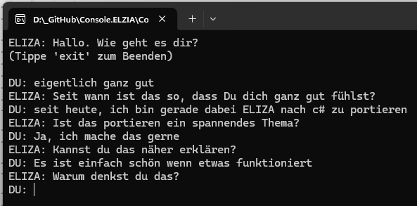

# ELZIA Chatbot


]

Das Programm setzte die Funktionen des klassischen [ELIZA-Chatbots](https://de.wikipedia.org/wiki/ELIZA) in C# unter NET 10 um. Der in den 1960er Jahren von Joseph Weizenbaum entwickelt wurde. ELIZA simuliert ein Gesprächspartner, indem es auf Benutzereingaben mit vorgefertigten Antworten reagiert, die oft psychotherapeutische Gespräche nachahmen.

## Historie
Diese ELIZA-Implementierung ist meine ditte Portierung von ELIZA. Die vorherigen Portierungen waren von [LIBS](https://de.wikipedia.org/wiki/Lisp) (mitte der 1980er) => [Fortran](https://de.wikipedia.org/wiki/Fortran) (Ende der 1990er) => [Basic](https://de.wikipedia.org/wiki/BASIC) und nun nach C# (01/2026).

## Implementierung
Diese Implementierung nutzt reguläre Ausdrücke, um Muster in den Eingaben der Benutzer zu erkennen und entsprechende Antworten zu generieren. Das Ziel ist es, eine einfache und interaktive Erfahrung zu bieten, die zeigt, wie frühe Chatbots funktionierten.

Von den ursprünglichen ELIZA-Skripten wurden nur die Kernfunktionen übernommen. 
- Erweitert wurde Regelbasierte (Regeln als JSON Datei gespeichert) Funktionen.
- Konzentraion auf verschiedene Themen
- Das "vergessen" von Gesprächsfäden, entwerder nach vergangener Zeit, oder mehrmaligen Themenwechsel
- Es werden reguläre Ausdrücke verwendet, um Muster in den Benutzereingaben zu erkennen und entsprechende Antworten zu generieren. Zurvor waren das reisne Stringoperationen.



## RuleSet JSON Datei

```json
{
  "pattern": "...",
  "priority": 100,
  "topic": "Emotion",
  "description": "...",
  "contextWeight": 3,
  "responses": [ "..." ],
  "isactive": true
}
```

Im Grunde genommen besteht jede Regel aus folgenden Komponenten:
- dem Pattern (bestehend aus regulären Ausdrücken)
- einer priorität (höhere Priorität wird bevorzugt)
- zugehöriger Thema (Topic)
- Wichtung des Kontextes (wie wichtig ist das Thema im Gespräch)
- mögliche Antworten (Responses)

```json
{
    "pattern": "\\b(traurig|deprimiert|unglücklich)\\b",
    "priority": 100,
    "topic": "Emotion",
    "description": "Reagiert auf Traurigkeit",
    "contextWeight": 3,
    "responses": [ "Warum fühlst du dich {0}?", "Seit wann bist du {0}?"],
    "isactive": true
},
```


eine noch mögliche Erweiterung wäre die möglichen Antwoprten auf die Fragen-Antwort-Kette ebenfalls aus dem JSON Ruleset zu beziehen.

```json
{
  "id": "emotion_sad",
  "description": "Traurigkeit erkennen",
  "enabled": true,
  "triggers": ["traurig", "unglücklich", "deprimiert"],
  "matchMode": "any",
  "topic": "Emotion",
  "priority": 100,
  "contextWeight": 3,
  "emotionLevel": 2,
  "responses": [
    { "text": "Warum fühlst du dich {0}?", "type": "question", "weight": 2 },
    { "text": "Das klingt sehr belastend.", "type": "support", "weight": 1 }
  ],
  "followUps": [
    "Was hat das ausgelöst?",
    "Was würde dir jetzt helfen?"
  ]
}
```

so könnten die derzeitige ELIZA Antworten noch weiter verfeinert und ausgebaut werden. Möglich wäre aber auch ein komplett neues RuleSet zu hinterlegen andere Aufgaben zu erfüllen.

Die ELIZA Version wird aktuell nur als Konsolenanwendung bereitgestellt.
```csharp
string databaseName = Path.Combine(DemoDataPath, "ElizaRule.json");

var eliza = new ElizaCore(databaseName);

Console.WriteLine("ELIZA: Hallo. Wie geht es dir?");
Console.WriteLine("(Tippe 'exit' zum Beenden)\n");

while (true)
{
    Console.Write("DU: ");
    var input = Console.ReadLine();

    if (string.IsNullOrWhiteSpace(input) || input.Equals("exit", StringComparison.OrdinalIgnoreCase))
    { 
        break;
    }

    var response = eliza.Respond(input);
    Console.WriteLine("ELIZA: " + response);
}
```

Trotz den eingeführten Verbesserungen, ist dieser ELIZA-Chatbot immer noch eine einfache Simulation und kann nicht die Tiefe und Nuancen eines echten menschlichen Gesprächs oder einer aktuellen KI erfassen. Dennoch bietet er einen interessanten Einblick in die frühen Entwicklungen der Künstlichen Intelligenz und der Mensch-Computer-Interaktion. Für einfache Chatbot-Aufgaben kann dieser Stand durchaus als Basis verwendet werden.

